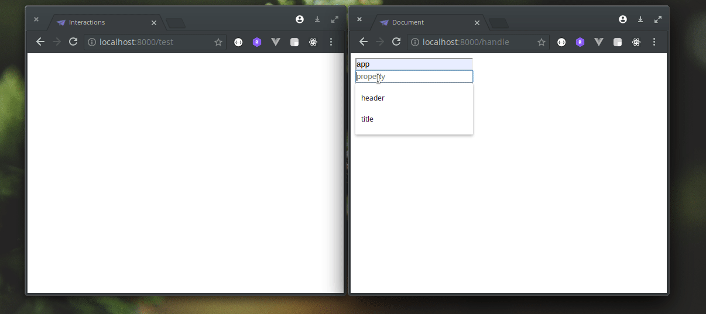

# Interact

This package adds an extra layer to your application that makes it possible to build real-time applications.

<p align="center">
<a href="https://packagist.org/packages/don47/interact"></a>
<a href="https://packagist.org/packages/don47/interact"></a>
<a href="https://packagist.org/packages/don47/interact"></a>
</p>



Requirements
------------
* PHP >=7.3.*
* [`modulusphp/framework`]('https://github.com/modulusphp/framework') >=1.9.9.5

Install
-------

Require the package with composer:
```
composer require don47/interact
```

Install the package:
```
php craftsman plugin:install --class="\Don47\Interact\Interact"
```

Register the plugin in the `app` config file:
```php
'plugins' => [
  Don47\Interact\Interact::class,
  ...
],
```

Append a new `"channels"` database connection in your `database` config file:
```php
'connections' => [
  'channels' => [
    'driver' => 'sqlite',
    'database' => database_path('interactions'),
    'prefix' => '',
  ],
  ...
],
```

Create a new sqlite file:
```
touch database/interactions
```

Then run your migrations:
```
php craftsman migrate all
```

Usage
-----

### PHP (using Interact in Medusa Templates)

#### Front-end

In order for your application to know if a page should stay alive, you need to use the `stay_alive()` helper method in your `view` file.

For example:

```
<body>
  {!! stay_alive(true) !!}
</body>
```

Since this is a PHP configuration, we need to pass `true` inside the `stay_alive` helper method so that our channel can be configured for us out of the box.

Now that we've told our view to stay alive, we can start listening to channels using the `interact()->listen()` helper method.

```
<body>
  {!! stay_alive(true) !!}

  <h1 id='header'></h1>

  {!! interact()->listen('app', function($response) {
      return "
        document.getElementById('header').innerHTML = {$response}.value;
      ";
  }) !!}
</body>
```

Our `view` will now listen to the `app` channel and update the h1 `header` tag each time we make updates from the back-end.

#### Back-end

To interact with our front-end, we just need to use the `interact()` helper method.
Let's say, we want to update the h1 `header` in our `view`, all we need to do, is specify the channel and the new value.

For example:

```php
interact('app', [
  'value' => 'This is the updated header'
]);
```

> Note: `DEV_AUTOLOAD_PLUGINS` must be set to true in your `.env` file for this plugin to work.

Available Helper methods
---

Helper         | Arguments                      | Description
---------------|--------------------------------|------------------------------
`stay_alive()` | `bool $withConfig`             | Makes page/view stay alive.   |
`interact()`   | `string $channel, array $data` | Interacts with the front-end. |

### Other

Helper                 | Arguments                            | Description
-----------------------|--------------------------------------|------------
`interact()->listen()` | `string $channel, closure $callback` | Listens to incoming messages from the back-end.

-----
## Todo
* Add JavaScript documentation
* Write tests
* Add Laravel support


Security
-------

If you discover any security related issues, please email donaldpakkies@gmail.com instead of using the issue tracker.

License
-------

The MIT License (MIT). Please see [License File](LICENSE) for more information.
